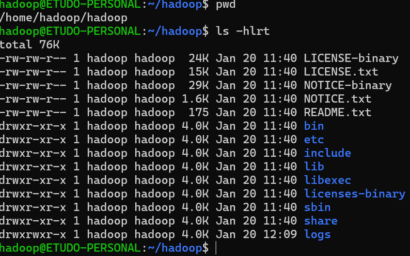

# Addendum To Medium Article on the Installation of Hadoop 3.3.6 on Ubuntu 22.04.2 LTS WSL
Medium article can be found here: [Complete Tutorial](https://medium.com/@madihaiqbal606/apache-hadoop-3-3-6-installation-on-ubuntu-22-04-2-lts-wsl-for-windows-bb57ed599bc6). Note, however, that Medium.com may hide this behind a paywall. If you are having trouble accessing the article please contact Dr. Etudo

## Don't Do Anything Until You Complete the Linux Terminal Tutorial
I cannot emphasize this enough. Don't start this lab until you complete the Linux tutorial. You can access the beginner Linux Terminal Tutorial from Ubuntu's [website](https://ubuntu.com/tutorials/command-line-for-beginners#1-overview)

## Adding the Hadoop User
The turial states "Create a user for Hadoop" and instructs you to use the following command:

```shell
professor@my-computer:~$ sudo adduser hadoop
```

When you run that command, you will be asked to enter some biographical information for your newly created user. You may opt not to provide that information, pressing enter at each prompt. 

## You need to create the file "authorized_keys"
The tutorial states "Add the public key to authorized_keys" and provides the command to achieve this. However, you need to first create the authorized_keys file. 

```shell
professor@my-computer:~$ touch ~/.ssh/authorized_keys
```

## When Setting Up SSL Do not Use a Passphrase
The tutorial states: "Create a passphrase for the keys..." Please do not do this, it is optional and you may forget your passphrase in the future. Just press enter when prompted for a passphrase.

## Ignore references to /usr/local/hadoop
The tutorial often refers to /usr/local/hadoop. However, you will note that in the screenshots, this directory is never used. This is an error on the part of the author. Whenever a reference to that direcotry is made, what the author **actually** means is: /home/hadoop/hadoop.

When the tutorial asks you to "move the extracted file to usr/local/hadoop" create a direcotry in home/hadoop, called "hadoop." Then move the extracted files in hadoop-3.3.6 to the newly created directory. If you list the contents of /home/hadoop/hadoop/ after this operation you should see the following:



After this step you are asked to create a "logs" directory in the same, erroneous location. Don't do that. ensure that your "logs" directory is located where mine is (see image above)

## Your hdfs-site.xml File should look like this (ignore the tutorial here):
```xml
<configuration>
   <property>
      <name>dfs.replication</name>
      <value>1</value>
   </property>
   <property>
      <name>dfs.name.dir</name>
      <value>file:///home/hadoop/hdfs/namenode</value>
   </property>
   <property>
      <name>dfs.data.dir</name>
      <value>file:///home/hadoop/hdfs/datanode</value>
   </property>
</configuration> 
```

## Your mapred-site.xml File should look like this (ignore the tutorial here):
```xml
<configuration>
    <property>
        <name>mapreduce.framework.name</name>
        <value>yarn</value>
    </property>
    <property>
        <name>yarn.app.mapreduce.am.env</name>
        <value>HADOOP_MAPRED_HOME=/home/hadoop/hadoop/bin/hadoop</value>
    </property>
    <property>
        <name>mapreduce.reduce.map</name>
        <value>HADOOP_MAPRED_HOME=/home/hadoop/hadoop/bin/hadoop</value>
    </property>
    <property>
        <name>mapreduce.reduce.env</name>
        <value>HADOOP_MAPRED_HOME=/home/hadoop/hadoop/bin/hadoop</value>
    </property>
</configuration>
```

## Once you finish the tutorial, please run the start scripts mentioned there. Then open the hdfs cluster dashboard in a browser to confirm that everythin is running

When you test your installation on the terminal, you should see the following:


Your dashboard should render in your browser while the cluster is running:
